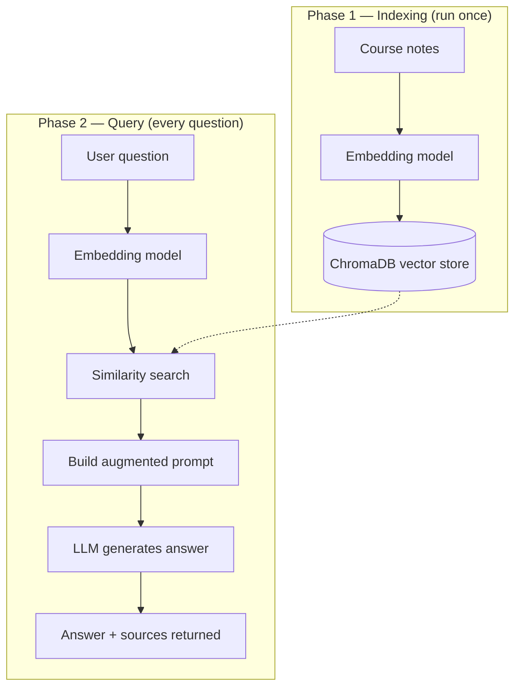

# RAG-Based Question Answering System

A Retrieval-Augmented Generation (RAG) pipeline built for a GenAI course assignment. It answers natural-language questions using a custom knowledge base, grounding every answer in real source text instead of relying purely on an LLM's own memory — and exposes the whole thing as a REST API.

## What This Does

Instead of asking an LLM a question directly (which risks outdated or hallucinated answers), this system:

1. Stores a knowledge base of text notes as searchable vector embeddings
2. Finds the most relevant notes for any given question
3. Feeds those notes to an LLM as context, so the answer is grounded in real, verifiable source material
4. Returns both the answer **and** the exact sources used, so every answer can be checked

## Architecture



**Indexing** happens once: notes are embedded and saved to disk.
**Query** happens on every request: the question is embedded the same way, matched against the stored notes, and the top matches are handed to the LLM to write a grounded answer.

## Project Structure

| File | What it does |
|---|---|
| `rag_system.py` | Core RAG logic. Connects to ChromaDB and Groq, indexes documents, retrieves relevant chunks, and generates answers. Also contains the knowledge base (36 notes across 8 GenAI topics). |
| `main.py` | FastAPI wrapper. Turns the RAG system into a web API with `/index`, `/ask`, `/health`, and `/documents/count` endpoints. |
| `evaluate.py` | Evaluation script. Runs 8 known question/answer pairs through the pipeline and measures retrieval accuracy and answer accuracy separately. |
| `requirements.txt` | Python dependencies needed to run the project. |
| `.env` | Stores the Groq API key. **Never commit this file with a real key** — see Setup below. |
| `rag_db/` | Auto-generated by ChromaDB the first time you index documents. Holds the persisted vector database. Not committed to Git (see `.gitignore`). |

## Setup

**1. Clone the repo and install dependencies**
```bash
pip3 install -r requirements.txt
```

**2. Add your own Groq API key**

Copy the example file and fill in your own key — never commit a real key to GitHub:
```bash
cp .env.example .env
```
Then edit `.env`:
```
GROQ_API_KEY=your_actual_key_here
```
Get a free key at [console.groq.com](https://console.groq.com/keys).

**3. Build the knowledge base (first time only)**
```bash
python3 rag_system.py
```
This indexes all notes into a local `rag_db/` folder. On the very first run, it also downloads a small embedding model (~90MB) — this can take up to a minute depending on your connection, but only happens once per machine.

**4. Start the API server**
```bash
uvicorn main:app --reload
```

**5. Try it out**

Open [http://127.0.0.1:8000/docs](http://127.0.0.1:8000/docs) in a browser — this interactive page is auto-generated by FastAPI and lets you test every endpoint without writing any code.

## API Endpoints

| Method | Endpoint | Description |
|---|---|---|
| `GET` | `/` | Basic status check. |
| `GET` | `/health` | Confirms the server is reachable and reports how many documents are indexed. |
| `GET` | `/documents/count` | Returns the number of documents currently in the knowledge base. |
| `POST` | `/index` | Adds new documents to the knowledge base without restarting the server. |
| `POST` | `/ask` | Submits a question; returns a generated answer plus the source notes used. |

Example request to `/ask`:
```json
{
  "question": "What is the difference between BERT and GPT?",
  "top_k": 3
}
```

## Evaluation

`evaluate.py` measures two things separately, since a wrong answer can come from either:

- **Retrieval accuracy** — did the vector database find the note that actually contains the answer?
- **Answer accuracy** — did the LLM's generated answer contain the expected fact?

Run it with:
```bash
python3 evaluate.py
```

This is a lightweight, keyword-based proxy for accuracy. A more rigorous evaluation would use semantic similarity scoring or an LLM-as-judge approach (e.g. the [RAGAS](https://github.com/explodinggradients/ragas) framework).

## Tech Stack

| Component | Technology |
|---|---|
| Vector database | [ChromaDB](https://www.trychroma.com/) (local, persistent) |
| Embedding model | `sentence-transformers` (`all-MiniLM-L6-v2`) |
| LLM / generation | [Groq API](https://groq.com/) (`openai/gpt-oss-20b`) |
| API framework | FastAPI + Uvicorn |
| Language | Python 3 |

## Important Notes

- **Never commit your real `.env` file.** It contains your private Groq API key. This repo's `.gitignore` already excludes it — double-check it hasn't been committed before pushing (`git status` should not list `.env`).
- **`rag_db/` is also gitignored.** It's regenerated automatically by running `rag_system.py`, so each person cloning this repo should build their own copy locally rather than relying on a committed database.
- **Available models depend on your Groq account.** If `openai/gpt-oss-20b` ever returns a "model not found" error, list the models your key actually has access to:
  ```bash
  python3 -c "from groq import Groq; import os; from dotenv import load_dotenv; load_dotenv(); print([m.id for m in Groq(api_key=os.getenv('GROQ_API_KEY')).models.list().data])"
  ```

## Possible Future Improvements

- Re-ranking retrieved chunks before generation
- Hybrid search (keyword + semantic) instead of semantic-only
- Semantic or LLM-as-judge evaluation instead of keyword matching
- Support for uploading documents (PDF/DOCX) directly instead of hardcoded text
